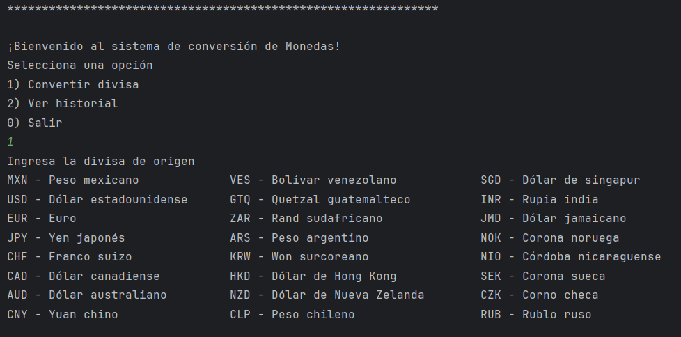

<h1 align="center"> Coin Converter Challenge ONE 💰</h1>

   

---

Proyecto desarrollado como un **conversor de divisas** a través de Java, que nos permite convertir entre las monedas de diversos países según se prefiera, ya que tiene soporte para la mayoría de ellas. Se utiliza la API de ExchangeRate, que nos permite obtener el cambio en tiempo real. La aplicación nos permite ingresar una cantidad de la divisa que queramos para obtener la tasa de cambio, además de mostrarnos un historial de las conversiones que hemos realizado a lo largo de la ejecución del programa.

<h2> Descripción del proyecto 📃</h2> 

---
El programa nos permite seleccionar entre una serie de divisas; el menú de selección solo contempla algunas. Sin embargo, si el usuario sabe el código base de su divisa, puede ingresarlo de igual forma. Nos permite ingresar un monto para la conversión. La aplicación realiza solicitudes a la API de ExchangeRate para obtener los cambios entre las monedas, los procesa y nos muestra las conversiones por consola. Además, cuenta con un historial de conversiones que añade la fecha y hora de registro de la solicitud. Todos estos registros se integran en un archivo .txt en caso de querer compartir las conversiones realizadas.

<h2> Divisas aceptadas: 💵</h2>

---
El programa acepta cualquier divisa; sin embargo, en el menú de selección se muestran las más populares y utilizadas a nivel mundial.

| **Moneda**                 | **Moneda**                  |
| -------------------------- | --------------------------- |
| MXN - Peso mexicano         | USD - Dólar estadounidense  |
| VES - Bolívar venezolano    | GTQ - Quetzal guatemalteco  |
| SGD - Dólar de Singapur     | INR - Rupia india           |
| EUR - Euro                  | ZAR - Rand sudafricano      |
| JPY - Yen japonés           | ARS - Peso argentino        |
| CHF - Franco suizo          | KRW - Won surcoreano        |
| CAD - Dólar canadiense      | HKD - Dólar de Hong Kong    |
| AUD - Dólar australiano     | NZD - Dólar de Nueva Zelanda|
| CNY - Yuan chino            | CLP - Peso chileno          |
| RUB - Rublo ruso            | NOK - Corona noruega        |
| NIO - Córdoba nicaragüense  | SEK - Corona sueca          |
| CZK - Corona checa          | JMD - Dólar jamaicano       |

Si se requiere otra tasa de cambio, basta con ingresar su código base y continuar con la ejecución.

<h2> Tecnologías 📂</h2>

---
**Lenguaje de desarrollo:**
Java usando jdk 17

**Dependencias:**
Gson: usado para el manejo de objetos JSON que provienen de la API

**Arquitectura:**
Uso de arquitectura modular a través de paquetes, con la siguiente estructura:
- main: punto de entrada al programa.
- modules: define las clases que modelan los objetos utilizados en el programa.
- functions: aquí se implementan las funciones principales del programa, incluyendo solicitudes, conversiones, administración, creación y lectura de archivos de historial.

<h2> Cómo ejecutar el programa 💻</h2>

---
**Instalación:**
1. Abre una terminal de git para clonar el repositorio
https://github.com/fullbuster-t/CoinConversor.git

2. Abrir el repositorio usando un IDE
3. Descargar e importar la depedencia Gson en su versión 2.11.0
https://mvnrepository.com/artifact/com.google.code.gson/gson/2.11.0

**Ejecución del conversor:**
1. Run la clase principal main
2. Ingresar una divisa de origen para la conversión
3. Ingresar una divisa de destino para la conversión
4. Ingresar el monto que queremos convertir
5. El resultado de la conversión se mostrará por consolar

<h2> Autor 🙋</h2>

---

Fullbuster - SoftDev🇲🇽

